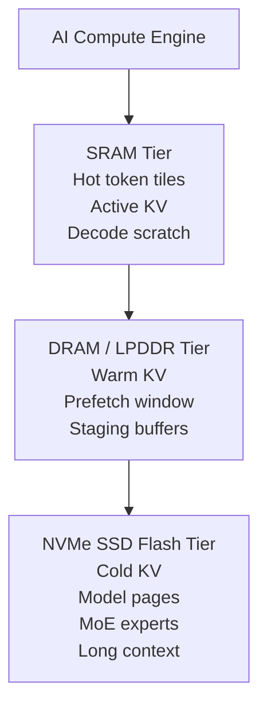
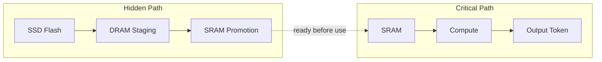
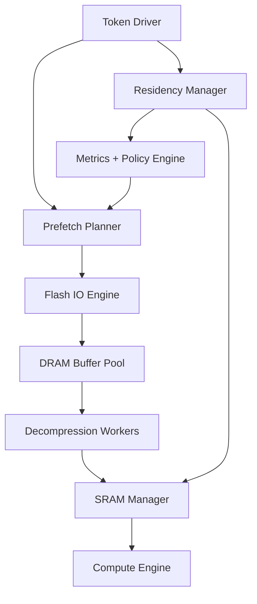
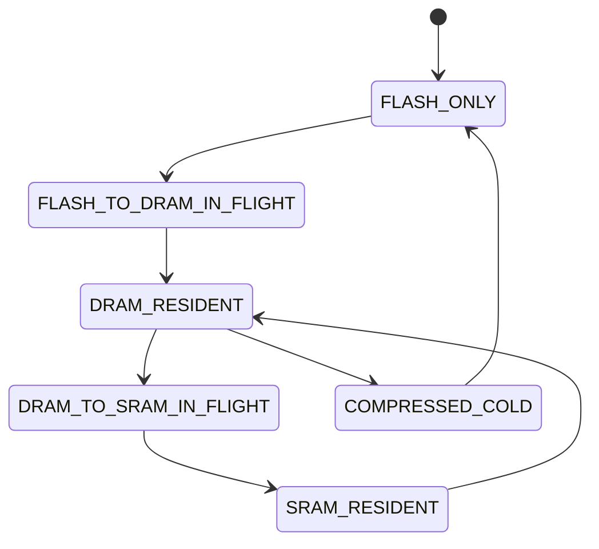
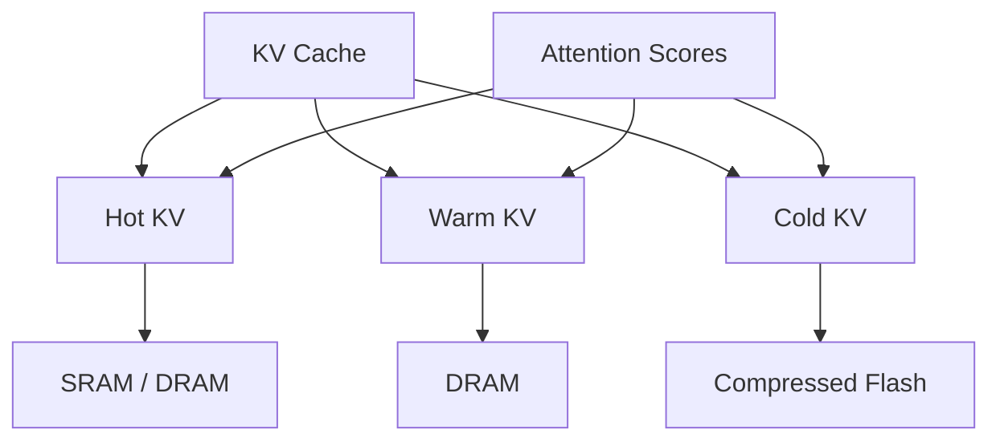
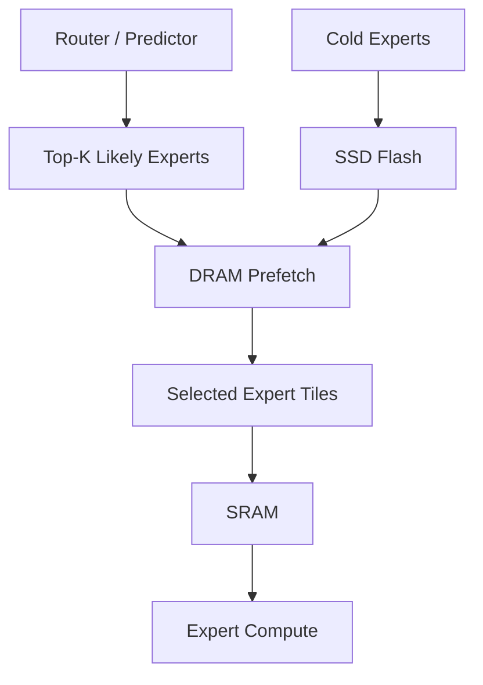

# Diagrams

## High-Level Memory Hierarchy

---

## Critical Path vs Hidden Path

---

## Runtime Components

---

## Object State Machine

---

## KV Cache Tiering

---

## MoE Expert Tiering

